# 🚀 Spark Data Engineering Pipeline

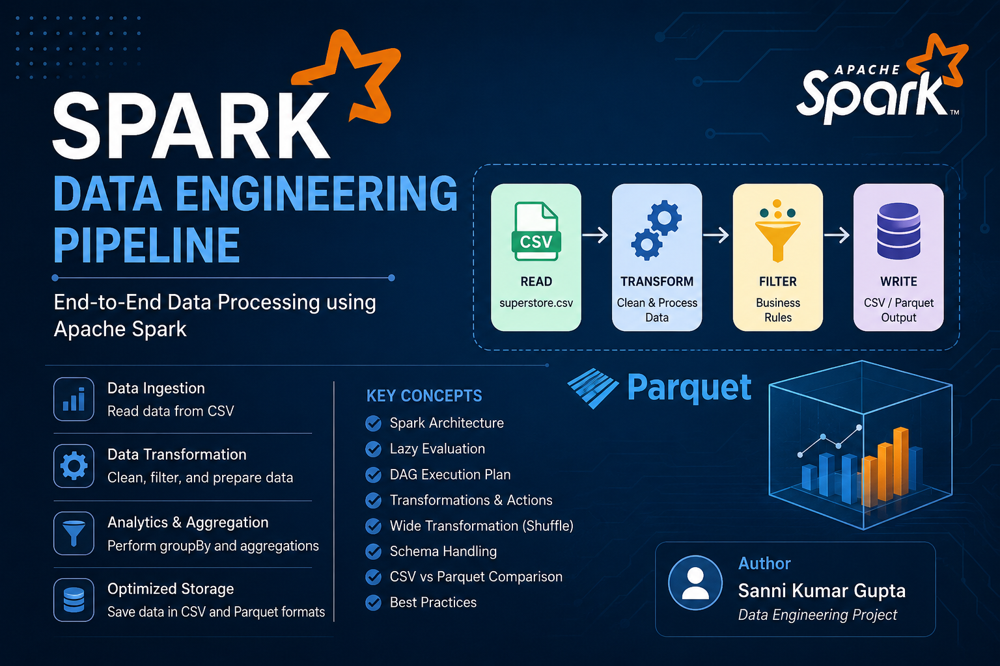

[](https://www.python.org/)
[](https://spark.apache.org/)
[](https://spark.apache.org/docs/latest/api/python/)
[]()
[](https://jupyter.org/)
[](https://code.visualstudio.com/)
[]()
[]()
[]()

## 📌 Project Overview

**Spark Data Engineering Pipeline** is a practical Apache Spark project that demonstrates how to build an end-to-end data engineering workflow with **PySpark**, **Python 3.11**, **Jupyter Notebook**, and **VS Code**.

The project shows how raw CSV data can be:
- read with a schema,
- cleaned and transformed,
- filtered and enriched,
- analyzed with Spark concepts such as **lazy evaluation**, **DAG**, and **shuffle**,
- written back as **CSV** and **Parquet**.

This repository is intentionally structured like a real-world data engineering submission so it can be used for learning, portfolio presentation, or recruiter review.

### What this project demonstrates

- Structured data ingestion
- Schema-aware processing
- Column pruning and row filtering
- Data type casting
- Derived column creation
- Null handling and duplicate removal
- CSV vs Parquet comparison
- Spark execution planning and optimization

### Why this matters

Spark is widely used in modern data engineering because it can process large datasets efficiently and scale across partitions. This project shows the same ideas in a smaller, local environment.

## 🧱 Project Architecture

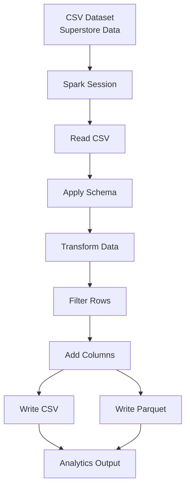

### Architecture summary

- **CSV Dataset**: raw Superstore file in `dataset/`
- **Spark Session**: local Spark runtime initialized in Python
- **Read CSV**: ingest source records into a Spark DataFrame
- **Apply Schema**: ensure correct types for reliable processing
- **Transform Data**: select, rename, cast, and enrich columns
- **Filter Rows**: keep relevant records for analysis
- **Add Columns**: create `Total_Amount` and `Order_Status`
- **Write CSV / Parquet**: export final curated outputs

## 📁 Folder Structure

```text
spark-data-engineering-pipeline/
├── dataset/
│   └── superstore.csv
├── notebooks/
│   └── spark_assignment.ipynb
├── output/
│   ├── 01_Spark_Session.png
│   ├── 02_Input_Dataset.png
│   ├── 03_Dataset_Schema.png
│   ├── 04_Rows_Columns.png
│   ├── 05_Data_Type_Casting.png
│   ├── 05_Selected_Column.png
│   ├── 06_Selected_Columns.png
│   ├── 07_Filtered_Data.png
│   ├── 08_Renamed_Columns.png
│   ├── 09_Total_Amount.png
│   ├── 10_Order_Category.png
│   ├── 11_Null_Values_Check.png
│   ├── 12_GroupBy_Shuffle.png
│   ├── 13_Lazy_Evaluation_DAG.png
│   ├── 14_Lazy_Evaluation_Result.png
│   ├── 18_Read_Parquet.png
│   ├── cover_image.png
│   ├── csv_parquet.png
│   ├── data_loaded.png
│   ├── csv_output/
│   │   └── final_output.csv
│   ├── parquet_output/
│   │   └── final_output.parquet
│   ├── superstore_output.csv
│   └── superstore_output.parquet
├── src/
│   ├── pipeline.py
│   ├── read_data.py
│   ├── spark_session.py
│   ├── transformations.py
│   └── utils.py
├── requirements.txt
└── README.md
```

- `src/` contains reusable pipeline code, `notebooks/` contains the walkthrough notebook, `output/` stores screenshots and generated data artifacts, `dataset/` contains the source Superstore CSV, and `requirements.txt` lists the minimal Python dependency set.

## ✨ Features

### Data engineering features

- Spark session creation with local master
- CSV ingestion with an explicit schema
- Schema validation and typed columns
- Column selection for cleaner processing
- Row filtering with Spark SQL expressions
- Column renaming for business readability
- Numeric casting for consistent calculations
- New derived columns such as `Total_Amount`
- Order classification with `Order_Status`
- Null value handling
- Duplicate removal
- Sorting by business value
- Export to CSV
- Export to Parquet

### Spark concepts demonstrated

- Lazy evaluation
- DAG generation
- Narrow and wide transformations
- Shuffle behavior
- Action-triggered execution
- Performance comparison between file formats

### Documentation features

- Mermaid architecture diagram
- Screenshot gallery
- Code examples for each major step
- Portfolio-ready GitHub layout

## 🧰 Technologies Used

| Technology | Version | Purpose |
|---|---:|---|
| Python | 3.11 | Core language for the pipeline |
| Apache Spark | 3.5.1 | Distributed data processing engine |
| PySpark | 3.5.1 | Python API for Spark DataFrames |
| Pandas | Compatible | Quick inspection and notebook support |
| Jupyter Notebook | Compatible | Interactive exploration and demos |
| VS Code | Compatible | Development environment |

## ⚙️ Installation

### 1) Clone the repository

```bash
git clone <your-repository-url>
cd spark-data-engineering-pipeline
```

### 2) Create a virtual environment

```bash
python -m venv venv
```

### 3) Activate the virtual environment on Windows

```bash
venv\Scripts\activate
```

### 4) Install dependencies

```bash
pip install -r requirements.txt
```

### 5) Run the notebook

Open `notebooks/spark_assignment.ipynb` in VS Code and execute the cells step by step.

### 6) Run the Python pipeline

```bash
python src/pipeline.py
```

### 7) Verify generated outputs

- `output/csv_output/final_output.csv`
- `output/parquet_output/final_output.parquet`
- screenshots inside `output/`

---

## 📊 Dataset

This project uses the popular **Superstore dataset**, a business dataset often used in analytics, BI, and data engineering examples.

### Important columns used in this project

- `Sales`
- `Profit`
- `Category`
- `Sub-Category`
- `Quantity`
- `Customer Name`
- `State`
- `City`

### Additional source columns in the raw CSV

- `Row ID`
- `Order ID`
- `Order Date`
- `Ship Date`
- `Ship Mode`
- `Customer ID`
- `Segment`
- `Country`
- `Postal Code`
- `Region`
- `Product ID`
- `Product Name`
- `Discount`

### Why this dataset is ideal for Spark learning

- It includes categorical and numeric data.
- It supports filtering and grouping exercises.
- It is realistic enough for ETL-style transformations.
- It is perfect for comparing row-based and columnar storage.

---

## 🔄 Project Workflow

### 1. Spark Session Setup

**Explanation**: Initialize a Spark session in local mode.

**Code**

```python
spark = SparkSession.builder.appName("Spark Assignment").master("local[*]").config("spark.sql.shuffle.partitions", "4").getOrCreate()
```

**Screenshot**

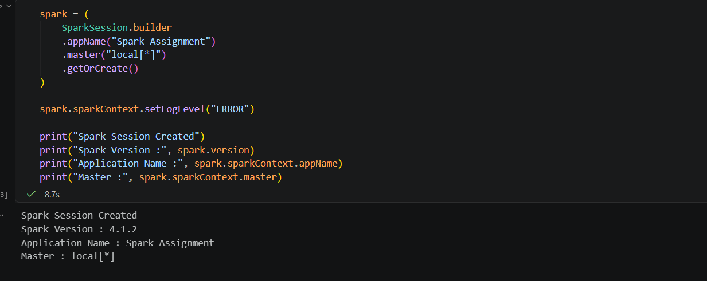

**Expected output**: Spark starts successfully and is ready to process data.

### 2. Read Input Dataset

**Explanation**: Load the Superstore CSV into a Spark DataFrame.

**Code**

```python
df = spark.read.option("header", True).schema(get_sales_schema()).csv(file_path)
```

**Screenshot**

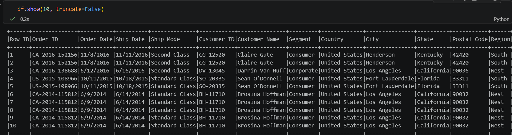

**Expected output**: Raw rows appear in Spark with schema-controlled ingestion.

### 3. Schema Handling

**Explanation**: Define a typed schema to avoid inconsistent inference.

**Code**

```python
schema = StructType([
    StructField("Order_ID", StringType(), True),
    StructField("Customer_Name", StringType(), True),
    StructField("Category", StringType(), True),
    StructField("Product", StringType(), True),
    StructField("Quantity", IntegerType(), True),
    StructField("Price", DoubleType(), True),
    StructField("City", StringType(), True)
])
```

**Screenshot**

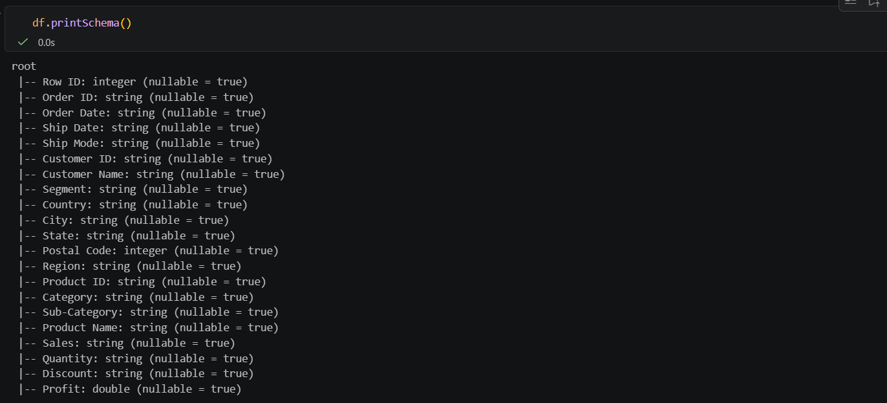

**Expected output**: Columns are mapped to the right Spark types.

### 4. Rows and Columns Preview

**Explanation**: Inspect row count and visible columns before transformation.

**Code**

```python
df.show(5, truncate=False)
```

**Screenshot**

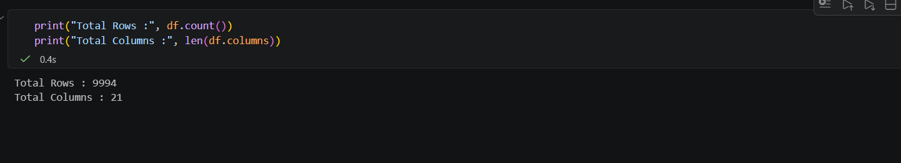

**Expected output**: A readable preview of the loaded dataset.

### 5. Data Type Casting

**Explanation**: Convert `Quantity` and `Price` to numeric types.

**Code**

```python
df = df.withColumn("Quantity", col("Quantity").cast("int")).withColumn("Price", col("Price").cast("double"))
```

**Screenshot**

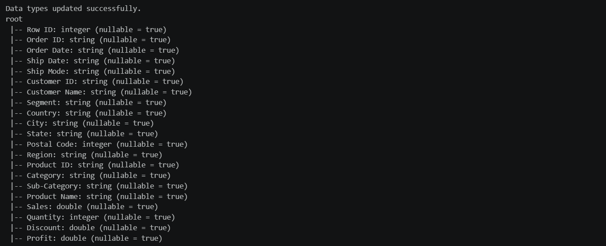

**Expected output**: Arithmetic becomes reliable for downstream calculations.

### 6. Selected Columns

**Explanation**: Keep only the columns needed for the pipeline.

**Code**

```python
selected_df = df.select("Order_ID", "Customer_Name", "Category", "Quantity", "Price", "City")
```

**Screenshot**

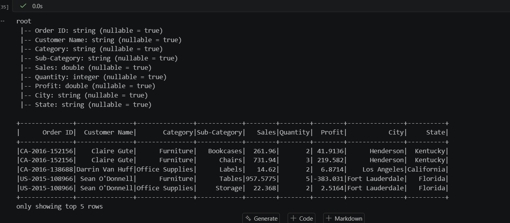

**Expected output**: Smaller, cleaner DataFrame with reduced width.

### 7. Filtered Data

**Explanation**: Filter rows where quantity is greater than 2.

**Code**

```python
filtered_df = df.filter(col("Quantity") > 2)
```

**Screenshot**

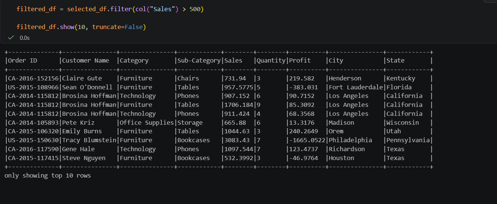

**Expected output**: Only qualifying rows remain.

### 8. Renamed Columns

**Explanation**: Rename fields to make the output more readable.

**Code**

```python
renamed_df = df.withColumnRenamed("Customer_Name", "Customer").withColumnRenamed("Order_ID", "OrderID")
```

**Screenshot**

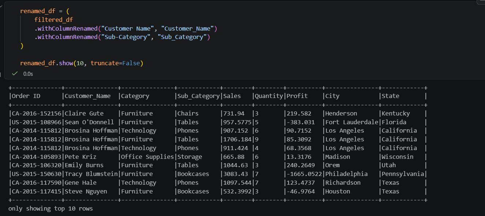

**Expected output**: Friendly column names for reporting.

### 9. Total Amount

**Explanation**: Add a derived revenue-style field.

**Code**

```python
df = df.withColumn("Total_Amount", round(col("Quantity") * col("Price"), 2))
```

**Screenshot**

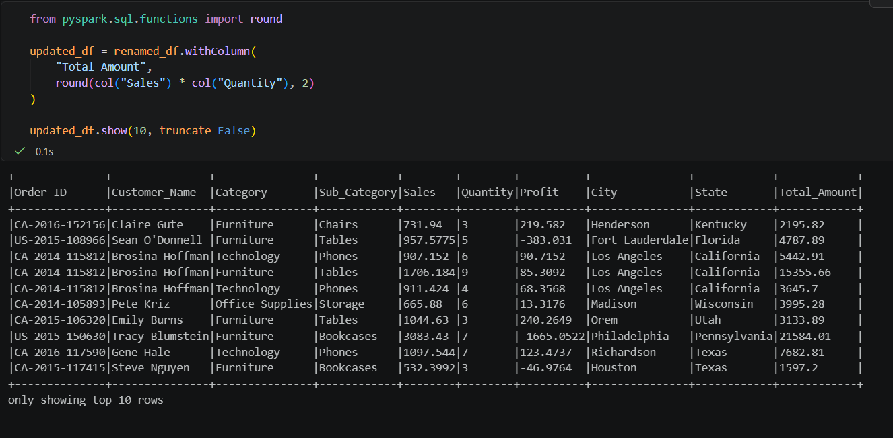

**Expected output**: Each row includes a computed total value.

### 10. Order Category

**Explanation**: Classify orders based on total amount.

**Code**

```python
df = df.withColumn("Order_Status", when(col("Total_Amount") >= 1000, "High Value").otherwise("Regular"))
```

**Screenshot**

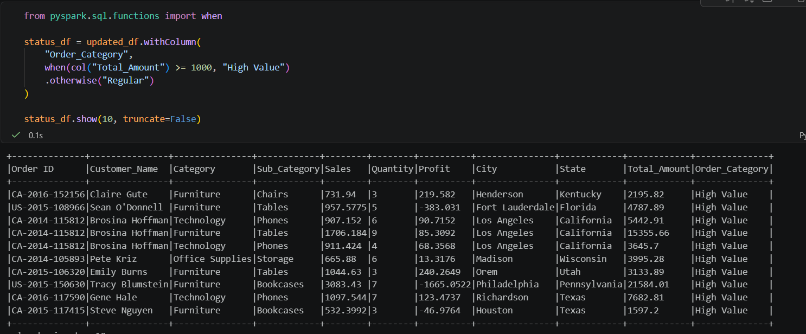

**Expected output**: Orders are segmented into business categories.

### 11. Null Values Check

**Explanation**: Fill missing values with safe defaults.

**Code**

```python
df = df.fillna({"Customer": "Unknown", "City": "Not Available", "Category": "Others", "Quantity": 0, "Price": 0.0})
```

**Screenshot**

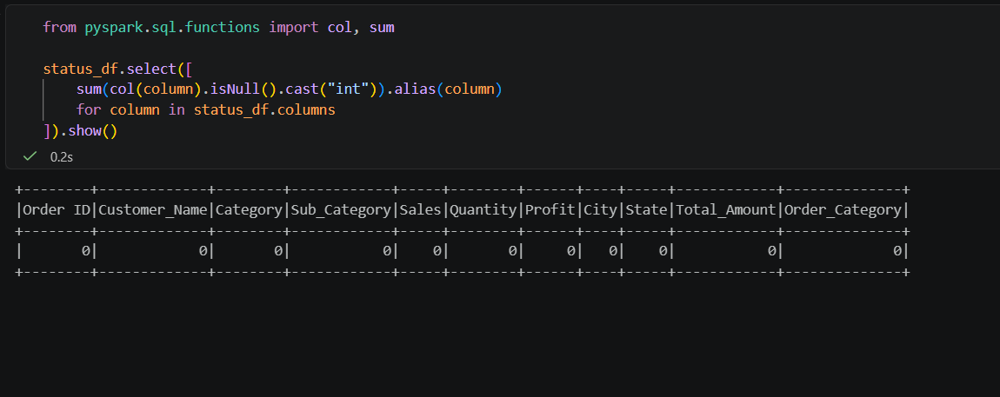

**Expected output**: Clean data with fewer integrity issues.

### 12. GroupBy Shuffle

**Explanation**: Group data by category and observe shuffle behavior.

**Code**

```python
category_sales = df.groupBy("Category").count()
```

**Screenshot**

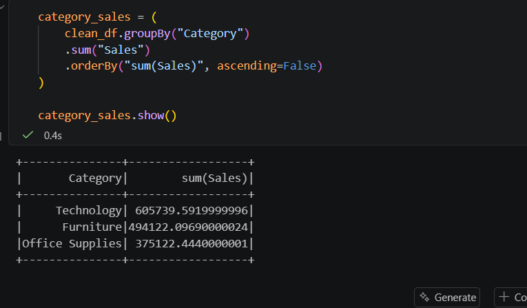

**Expected output**: Aggregated counts and a visible shuffle concept.

### 13. Lazy Evaluation and DAG

**Explanation**: Build the execution plan without running it immediately.

**Code**

```python
lazy_df = df.filter(col("Quantity") > 2).select("Category", "Quantity")
```

**Screenshot**

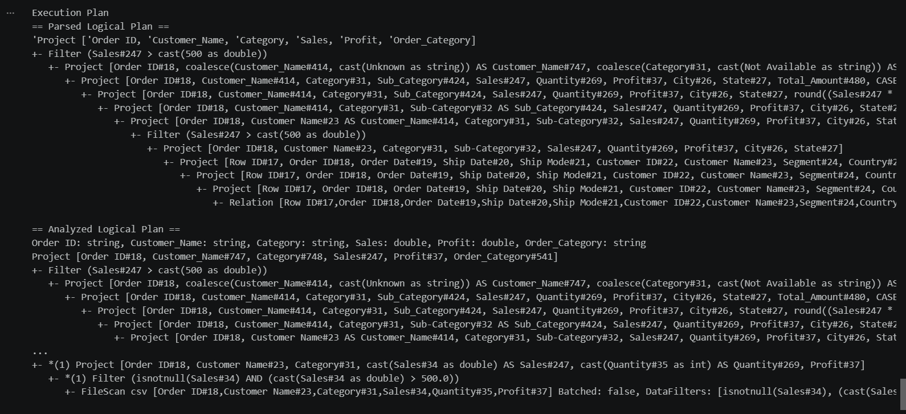

**Expected output**: Spark shows a logical plan before action execution.

### 14. Lazy Evaluation Result

**Explanation**: Trigger the transformation with an action.

**Code**

```python
lazy_df.show()
```

**Screenshot**

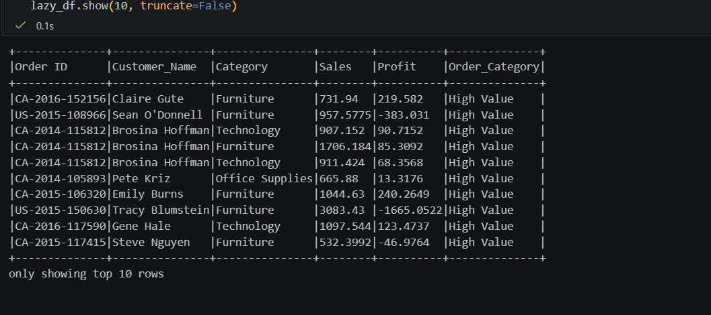

**Expected output**: The plan is executed and data is displayed.

### 15. CSV vs Parquet Comparison

**Explanation**: Compare row-based and columnar storage formats.

**Code**

```python
save_as_csv(transformed_df, csv_output)
save_as_parquet(transformed_df, parquet_output)
```

**Screenshot**

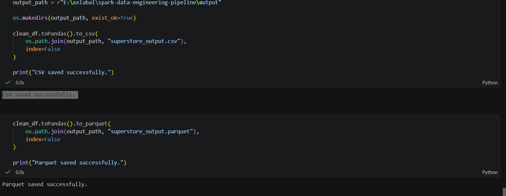

**Expected output**: CSV is portable; Parquet is analytics-friendly.

### 16. CSV Output

**Explanation**: Save the final transformed DataFrame as CSV.

**Code**

```python
(df.write.mode("overwrite").option("header", True).csv(csv_output))
```

**Artifact**

`output/csv_output/final_output.csv`

**Expected output**: A clean CSV file ready for sharing.

### 17. Parquet Output

**Explanation**: Save the final transformed DataFrame as Parquet.

**Code**

```python
(df.write.mode("overwrite").parquet(parquet_output))
```

**Artifact**

`output/parquet_output/final_output.parquet`

**Expected output**: A compact Parquet dataset ready for analytics.

### 18. Read Parquet

**Explanation**: Read the Parquet file back into Spark.

**Code**

```python
df = spark.read.parquet(file_path)
```

**Screenshot**

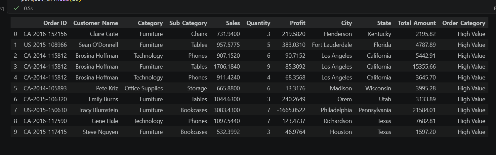

**Expected output**: The Parquet round trip works correctly.

### 19. Performance Insights

**Explanation**: Review Spark execution and format efficiency.

**Code**

```python
spark.conf.set("spark.sql.shuffle.partitions", "4")
```

**Screenshot**


**Expected output**: Better understanding of Spark performance trade-offs.

---

## 🧪 Code Examples

### Spark Session

```python
from pyspark.sql import SparkSession

spark = (
    SparkSession.builder
    .appName("Spark Assignment")
    .master("local[*]")
    .config("spark.sql.shuffle.partitions", "4")
    .getOrCreate()
)
```

### Read CSV

```python
df = spark.read.option("header", True).schema(get_sales_schema()).csv(file_path)
```

### Schema

```python
schema = StructType([
    StructField("Order_ID", StringType(), True),
    StructField("Customer_Name", StringType(), True),
    StructField("Category", StringType(), True),
    StructField("Product", StringType(), True),
    StructField("Quantity", IntegerType(), True),
    StructField("Price", DoubleType(), True),
    StructField("City", StringType(), True)
])
```

### Filter

```python
filtered_df = df.filter(col("Quantity") > 2)
```

### Select

```python
selected_df = df.select("Order_ID", "Customer_Name", "Category", "Quantity", "Price", "City")
```

### Rename

```python
renamed_df = df.withColumnRenamed("Customer_Name", "Customer").withColumnRenamed("Order_ID", "OrderID")
```

### Cast

```python
df = df.withColumn("Quantity", col("Quantity").cast("int"))
df = df.withColumn("Price", col("Price").cast("double"))
```

### GroupBy

```python
category_sales = df.groupBy("Category").count()
```

### Write CSV

```python
(df.write.mode("overwrite").option("header", True).csv(csv_output))
```

### Write Parquet

```python
(df.write.mode("overwrite").parquet(parquet_output))
```

---

## 🧠 Spark Concepts Covered

- [x] Spark Architecture
- [x] Driver
- [x] Executors
- [x] Cluster Manager
- [x] Lazy Evaluation
- [x] DAG
- [x] Transformations
- [x] Actions
- [x] Narrow Transformation
- [x] Wide Transformation
- [x] Shuffle
- [x] Predicate Pushdown
- [x] Schema Handling
- [x] CSV
- [x] Parquet
- [x] Performance Optimization
- [x] Data Pipeline

---

## 📈 Performance Comparison

| Aspect | CSV | Parquet |
|---|---|---|
| Storage | Row-based text | Columnar binary |
| Compression | Limited | Efficient |
| Read Speed | Slower on analytics | Faster for column scans |
| Write Speed | Simple | Optimized |
| Analytics | Portable | Better for Spark |
| Performance | Lower | Higher |

### Performance takeaway

Parquet is usually the better choice for repeated Spark reads because it reduces I/O, compresses data well, and supports column pruning.

---

## ⚡ Performance Insights

### Why Spark is fast

Spark keeps data processing distributed across partitions and can execute many tasks in parallel.

### Why lazy evaluation matters

Spark delays execution until an action is triggered, which lets it optimize the plan first.

### Why DAG is useful

A DAG shows transformation lineage and allows Spark to optimize how work is executed.

### Why shuffle is expensive

Shuffle moves data across executors, which adds network and disk overhead.

### Why Parquet is better

Parquet is columnar, compressed, and ideal for analytical workloads.

### Why `show()` is preferred over `collect()`

`show()` is safer for previews because it avoids pulling the full dataset to the driver.

---

## 🧩 Challenges Faced

### CSV schema issues

CSV files often need explicit schemas to prevent inconsistent type inference.

### Data type conversion

Some values must be cast before arithmetic or grouping can be done safely.

### Null values

Missing values were handled using `fillna()` to keep the dataset usable.

### Windows Spark setup

Windows Spark environments can require careful path and Java configuration.

### Java compatibility

Spark depends on Java, so version compatibility is important.

### Spark environment configuration

A reusable Spark session builder and shuffle tuning made the project stable.

---

## ✅ Results

- Built an end-to-end Spark ETL pipeline.
- Processed the Superstore dataset successfully.
- Generated transformed CSV output.
- Generated transformed Parquet output.
- Demonstrated Spark concepts like lazy evaluation, DAG, and shuffle.
- Produced documentation-ready screenshots for GitHub.

---

## 🔮 Future Improvements

- Spark Structured Streaming
- Kafka integration
- Delta Lake storage
- Azure Data Factory orchestration
- Databricks deployment
- Spark SQL analytics
- MLlib-based predictions

---

## 🏁 Conclusion

This project shows how Apache Spark can be used to build a clean, readable, and scalable data pipeline.

It covers the core ideas behind modern data engineering: ingestion, schema control, transformation, optimization, and storage.

The result is a strong portfolio project that is both educational and recruiter-friendly.

---

## 👨‍💻 Author

**Sanni Kumar Gupta**

- Data Engineering Enthusiast
- Apache Spark
- Python Developer
- Jupyter Notebook User
- VS Code Practitioner

### Connect

- **GitHub:** `https://github.com/<your-username>`
- **LinkedIn:** `https://www.linkedin.com/in/<your-linkedin>`
- **Email:** `<your-email@example.com>`

---

## 📷 Screenshot Gallery

> This gallery documents the full pipeline with concise notes for each artifact.

### 01. Spark Session


Creates the session and confirms Spark is ready. Used to initialize the driver and local runtime.

### 02. Input Dataset


Loads the raw Superstore CSV and verifies the ingestion step.

### 03. Dataset Schema


Shows typed columns so Spark can process the data correctly.

### 04. Rows and Columns


Validates the initial shape of the dataset and preview rows.

### 05. Data Type Casting


Converts fields to proper numeric types for calculations.

### 06. Selected Columns


Demonstrates column pruning and cleaner downstream processing.

### 07. Filtered Data


Shows predicate filtering where quantity is greater than two.

### 08. Renamed Columns


Makes technical column names easier to read.

### 09. Total Amount


Adds a derived total value column for business analysis.

### 10. Order Category


Segments rows by business value using a conditional rule.

### 11. Null Values Check


Checks and resolves missing values for cleaner output.

### 12. GroupBy Shuffle


Illustrates wide transformation behavior and shuffle cost.

### 13. Lazy Evaluation DAG


Shows how Spark builds the logical plan before execution.

### 14. Lazy Evaluation Result


Shows the result after an action triggers execution.

### 15. CSV vs Parquet


Highlights the difference between row-based and columnar storage.

### 16. CSV Output

`output/csv_output/final_output.csv`

The final CSV output that can be shared or opened externally.

### 17. Parquet Output

`output/parquet_output/final_output.parquet`

The final Parquet output optimized for analytics workloads.

### 18. Read Parquet


Confirms that the Parquet file can be read back into Spark.

### 19. Performance Insights


Summarizes performance lessons from the pipeline.

---

## 🧭 Repository Highlights

- Modular Spark code in `src/`
- Interactive notebook in `notebooks/`
- Generated artifacts in `output/`
- Clean CSV input in `dataset/`
- Simple dependency setup in `requirements.txt`

---

## 🙌 Acknowledgements

Thanks to the Apache Spark and PySpark communities for the excellent ecosystem and documentation.

---

## ⭐ Footer

> ⭐ If you found this project useful, please give it a Star.

**Made with ❤️ using Apache Spark and Python.**
